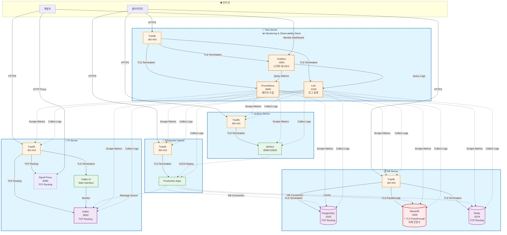

# IaC with Ansible

이 저장소는 현재 운영 중인 5개 서버 인스턴스의 인프라 구성 코드를 관리합니다. Ansible을 사용하여 인프라를 코드로 관리하며, Docker Compose를 기반으로 각 서비스가 컨테이너화되어 관리됩니다.

## Structure

```text
infrastructure/
├── ansible.cfg                 # Ansible 설정 파일
├── requirements.yml            # Ansible Galaxy 의존성
├── inventory/                  # 인벤토리 파일
│   ├── production              # 프로덕션 인벤토리
│   ├── group_vars/             # 그룹별 변수
│   │   ├── all.yml             # 모든 호스트 공통 변수
│   │   ├── docker_hosts.yml    # Docker 호스트 변수
│   │   └── traefik_hosts.yml   # Traefik 호스트 변수
│   └── host_vars/              # 호스트별 변수
│       ├── db-server/          # 서버별 변수
│       │   ├── vars.yml        # 비민감 변수
│       │   └── vault.yml       # 민감 변수 (암호화)
│       ├── jenkins-server/   
│       │   ├── vars.yml
│       │   └── vault.yml
│       ├── pi-server/         
│       │   ├── vars.yml
│       │   └── vault.yml
│       ├── production-server/ 
│       │   ├── vars.yml
│       │   └── vault.yml
│       └── test-server/      
│           ├── vars.yml
│           └── vault.yml
├── roles/                     # Ansible 역할
│   ├── common/                # 공통 시스템 설정
│   ├── docker/                # Docker 설치 및 설정
│   ├── traefik/               # Traefik 리버스 프록시
│   ├── kafka/                 # Kafka 클러스터
│   ├── squid_proxy/           # Squid 프록시 서버
│   └ ...
└── playbooks/                 # Ansible 플레이북
    ├── site.yml               # 마스터 플레이북
    ├── docker.yml             # Docker 설치
    ├── traefik.yml            # Traefik 배포
    ├── pi.yml                 # Pi 서버 전용
    ├── db.yml                 # DB 서버 전용
    ├── jenkins.yml            # Jenkins 서버 전용
    └ ...

```

### 인프라 아키텍처 다이어그램



## Settings

### 사전 요구사항

1. **Ansible 설치** (컨트롤 노드)

   ```bash
   # macOS
   brew install ansible

   # Ubuntu/Debian
   sudo apt update
   sudo apt install ansible

   # Python pip
   pip install ansible
   ```

2. **Ansible Collections 설치**

   ```bash
   ansible-galaxy install -r requirements.yml
   ```

3. **SSH 키 설정**

   ```bash
   # SSH 키 생성 (아직 없는 경우)
   ssh-keygen -t rsa -b 4096 -f ~/.ssh/id_rsa

   # 서버별로 다른 키 생성도 가능
   ssh-keygen -t rsa -b 4096 -f ~/.ssh/db_key
   ssh-keygen -t rsa -b 4096 -f ~/.ssh/jenkins_key

   # 각 서버에 SSH 공개키 복사 (서버별 SSH 유저와 키 파일에 맞게)
   ssh-copy-id -i ~/.ssh/id_rsa sayho@<PI_SERVER_IP>
   ssh-copy-id -i ~/.ssh/db_key ubuntu@<DB_SERVER_IP>
   ssh-copy-id -i ~/.ssh/jenkins_key jenkins@<JENKINS_SERVER_IP>
   # 각 서버마다 해당하는 키로 실행
   ```

### 초기 설정

1. **인벤토리 파일 수정**

   `inventory/production` 파일을 열고 각 서버의 실제 IP 주소, SSH 유저명, SSH 키 파일 경로로 변경:

   ```ini
   [db]
   db-server ansible_host=YOUR_DB_SERVER_IP ansible_user=ubuntu ansible_ssh_private_key_file=~/.ssh/id_rsa

   [jenkins]
   jenkins-server ansible_host=YOUR_JENKINS_SERVER_IP ansible_user=jenkins ansible_ssh_private_key_file=~/.ssh/jenkins_key

   [pi]
   pi-server ansible_host=YOUR_PI_SERVER_IP ansible_user=sayho ansible_ssh_private_key_file=~/.ssh/pi_key

   # 각 서버별로 실제 설정값 지정
   # ansible_host: 서버 IP 또는 도메인
   # ansible_user: SSH 유저명
   # ansible_ssh_private_key_file: SSH 키 파일 경로 (서버마다 다른 키 사용 가능)
   ```

2. **호스트 변수 설정**

   각 `host_vars/*.yml` 파일에서 서버별 설정 수정:
   - 도메인 이름 (`domain`)
   - Let's Encrypt 이메일 (`traefik_acme_email`)
   - 비밀번호 및 인증 정보
   - Kafka 클러스터 ID (고유값 생성 필요)

3. **연결 테스트**

   ```bash
   ansible all -m ping
   ```

## Usage

### Quick Start with Makefile

Makefile을 사용해 Ansible 명령어를 관리합니다.

```bash
# 도움말 보기
make help

# Ansible collections 설치 (처음 한 번만)
make install

# 서버 연결 테스트
make check
```

### 전체 인프라 배포

```bash
# 모든 서버에 전체 스택 배포
make deploy-all

# Dry-run으로 먼저 확인
make dry-run
```

### 개별 서버 배포

```bash
# Pi 서버만 배포
make deploy-pi

# DB 서버만 배포
make deploy-db

# Jenkins 서버만 배포
make deploy-jenkins
```

### 특정 역할만 실행

```bash
# Docker만 설치
make deploy-docker

# Traefik만 배포
make deploy-traefik
```

### Dry-run

```bash
# 전체 인프라 dry-run
make dry-run

# 특정 서버 dry-run
make dry-run-pi
make dry-run-db
make dry-run-jenkins
```

## Host server directory structure

Ansible 배포 후 각 서버의 디렉토리 구조:

```text
~/server/                      # 모든 서비스의 base directory
├── traefik/                   # Traefik 리버스 프록시
│   ├── docker-compose.yml
│   ├── .env
│   └── letsencrypt/
│       └── acme.json
├── kafka/                     # Kafka 클러스터 (Pi 서버만)
│   ├── docker-compose.yml
│   ├── .env
│   ├── data/                  # Kafka 데이터
│   └── scripts/
│       └── init-kafka-users.sh
└── squid/                     # Squid Proxy (Pi 서버만)
    ├── docker-compose.yml
    ├── squid.conf
    ├── conf/                  # 추가 설정 파일
    └── logs/                  # Squid 로그
```

각 서비스는 SSH 유저의 홈 디렉토리 기준 `~/server/{서비스명}` 형태로 배포됩니다.

## Key Components

### 1. Docker

- 모든 서버에 Docker와 Docker Compose 설치
- 공통 네트워크 (`proxy`) 자동 생성
- 로그 로테이션 설정

### 2. Traefik

- 리버스 프록시 및 로드 밸런서
- 자동 SSL 인증서 (Let's Encrypt)
- HTTP → HTTPS 자동 리다이렉트
- 대시보드 제공

### 3. Kafka (Pi 서버)

- KRaft 모드 Kafka 클러스터
- SASL/SCRAM 인증
- Kafka UI 포함
- Traefik TCP 라우팅

### 4. Squid Proxy (Pi 서버)

- HTTP/HTTPS 프록시
- 기본 인증 지원
- 접근 제어 및 로깅
- Traefik TCP 라우팅

## Troubleshooting

### 연결 문제

```bash
# SSH 연결 확인
make ping

# 상세 디버깅 (직접 ansible 명령어 사용)
ansible all -i inventory/production -m ping -vvv

# 특정 호스트 디버깅
ansible pi -i inventory/production -m setup
```

### 서비스 상태 확인

```bash
# Docker 컨테이너 상태 확인
make docker-ps

# 특정 서비스 로그 확인
make docker-logs HOST=pi SERVICE=traefik
make docker-logs HOST=db SERVICE=postgres
```

### 변수 확인

```bash
# 호스트 변수 확인
ansible-inventory -i inventory/production --host pi-server

# 그룹 변수 확인
ansible-inventory -i inventory/production --graph
```

### Vault 관리

```bash
# Vault 파일 편집
make vault-edit FILE=inventory/host_vars/pi-server/vault.yml

# Vault 파일 보기
make vault-view FILE=inventory/host_vars/pi-server/vault.yml
```

### 로그 정리

```bash
# Ansible 로그 파일 정리
make clean
```

## Development

### Code Quality

#### Linting

프로젝트는 ansible-lint를 사용하여 코드 품질을 관리합니다.

```bash
# 전체 프로젝트 린트 실행
make lint

# 자동 수정 포함
ansible-lint --fix
```

#### Git Hooks

커밋 전에 자동으로 ansible-lint를 실행하도록 설정할 수 있습니다.

```bash
# Git hooks 설치
make install-hooks
```

설치 후 `git commit` 실행 시 자동으로 ansible-lint가 실행되며, 문제가 있으면 커밋이 차단됩니다.

**Hook 동작:**

- 커밋 전 ansible-lint 자동 실행
- `--fix` 옵션으로 자동 수정 가능한 문제는 자동 수정
- 린트 통과해야만 커밋 가능

**Hook 비활성화 (임시):**

```bash
# 특정 커밋만 hook 건너뛰기
git commit --no-verify -m "message"
```

## Plugins

### vscode

- Ansible language support
- Better Jinja -> jinja + yml, jinja + html 등 복함 syntax highlight 지원
